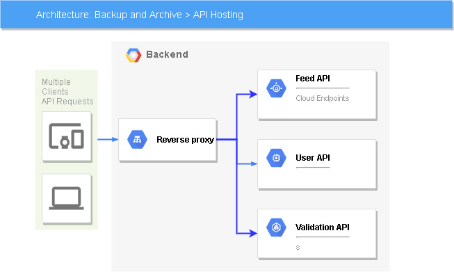

# Udacity_capstone

This is simple project that build on microservice architecture which develops on container-based on orchestration tool (Kubernetes)

The project consists on
1. *udacity-frontend* - For Ionic client web application, which consumes the RestAPI Backend
2. *udacity-restapi-feed* - For "feed" microservice
3. *udacity-restapi-user* - For "user" microservice
4. *udacity-reverseproxy* - For running the Nginx as a reverse-proxy server
5. *udacity-validation* - For validate image file name to prevent some reversed word from using as file names validate the Feed/signed-url EndPoint
so that we apply chained microservice desgin pattern 

Build the application
1. Run udacity-c3-deployment\docker\ build.cmd *shell scrpit to build all images*
2. Run udacity-c3-deployment\docker\ push.cmd *shell script to push all images to the docker hub account*
3. Run udacity-c3-deployment\k8s\all.cmd *Shell script to apply all secret-configmap-deploymentservice for all service*
4. Run udacity-c3-deployment\k8s\forward frontend.cmd *Shell script to forward port for frontend services*
5. Run udacity-c3-deployment\k8s\forward reverseproxy.cmd *Shell script to forward port for reversproxy services*
6. Run udacity-c3-deployment\k8s\forward validation.cmd *Shell script to forward port for validation services*

**Note that

By default Kubernetes offer RollingUpdate strategy feature is set to RollingUpdate that allow us to update the container with Zero downtime and build System which enhanced in resiliency 
Two versions  but some  deployment run in one replicas set due to local cpu limit 
- 'A' and 'B' of the same application can run simultaneously and serve the traffic by scaling up/scaling down 

